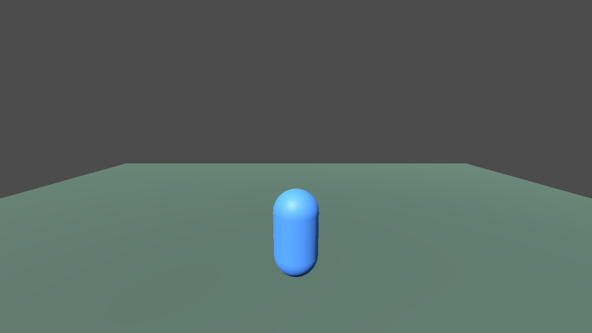

# GODOT-MCP

<p align="center">
  
</p>

Godot MCP AI Bridge for safe AI-assisted Godot 4.x development.

Current version: `0.4.1`

This repository gives Codex, Claude, or another MCP-capable AI client a small, safe API for working inside a Godot 4.x project. The MCP server can inspect files, create small Godot resources, queue generation jobs, and call a local Godot EditorPlugin bridge when richer editor context is needed.

GODOT-MCP is instruction-first: Codex, Claude, or the user's AI model should plan the work, write Godot-specific content, and decide validation loops. The JavaScript MCP tools are intentionally small safe primitives for project IO, imports, generation jobs, editor/Godot checks, and sandbox enforcement.

For complex or unfamiliar mechanics, the AI client should research first on GitHub, YouTube, official Godot docs, and credible web sources, then adapt the best Godot 4 pattern with source/license notes.

The goal is conservative automation:

1. Inspect first.
2. Keep all file changes inside the project.
3. Avoid destructive operations.
4. Use provider `none` by default so generation requests become reviewable JSON jobs.
5. Use the optional editor bridge only for local Godot editor workflows.

<p align="center">
  
</p>

## Quick Start For Windows

You need:

- Godot 4.x
- Node.js 18 or newer
- a Godot project folder that contains `project.godot`

1. Open PowerShell in your Godot project folder.
2. Run this one command:

```powershell
powershell -NoProfile -ExecutionPolicy Bypass -Command "$s=Join-Path $env:TEMP 'install-godot-mcp.ps1'; Invoke-WebRequest 'https://raw.githubusercontent.com/gordidima-rgb/GODOT-MCP/main/tools/install-godot-mcp.ps1' -OutFile $s; & $s -ProjectPath (Get-Location)"
```

The installer copies the Godot editor plugin and the local MCP server into your project. It also enables the plugin in `project.godot`, saves a backup of `project.godot`, and writes a ready Codex config file named `godot-mcp.codex.toml`.

3. Open or restart Godot 4.x.
4. Find the `AI MCP Bridge` dock and press `Start`. Leave the port as `8765` unless it is already busy.
5. Open `godot-mcp.codex.toml`, copy the `[mcp_servers.godotMCP]` block into your Codex config, then restart Codex.
6. Ask Codex:

```text
Run godot_doctor, then godot_project_scan.
```

For Codex, Claude, or any MCP-capable client, use `docs/MCP_CAPABILITIES.md` as the full tool map.
Use `docs/MCP_AGENT_INSTRUCTIONS.md` for the instruction-first operating model.

If you already cloned this repository, you can run the installer locally from the project root:

```powershell
powershell -NoProfile -ExecutionPolicy Bypass -File .\tools\install-godot-mcp.ps1
```

## Codex Setup

The installer creates `godot-mcp.codex.toml` with the correct paths for your computer. If you need to write the config by hand, use this shape and replace `<PROJECT_ROOT>` with the folder that contains `project.godot`:

```toml
[mcp_servers.godotMCP]
command = "node"
args = [ "<PROJECT_ROOT>/tools/mcp-godot/src/server.mjs", "--project-root", "<PROJECT_ROOT>" ]
startup_timeout_sec = 20
env = { GODOT_PROJECT_ROOT = "<PROJECT_ROOT>", GODOT_MCP_PORT = "8765" }
```

On Windows, the Codex config file is usually here:

```powershell
$env:USERPROFILE\.codex\config.toml
```

Restart Codex after changing MCP config. You can also use the Godot dock button `Copy Codex config`, or ask the MCP server for a ready TOML block after it is connected:

```text
Call godot_codex_config.
```

## Run Doctor

`godot_doctor` checks the setup in one place:

- `projectRoot`
- MCP `serverVersion`
- Node.js version
- whether `project.godot` exists
- whether Godot CLI is found
- whether the bridge is reachable
- whether `.env` exists
- provider status
- expected folders: `scenes`, `scripts`, `Assets`, `assets`, `generation_jobs`
- beginner-friendly recommendations

The bridge dock also has a `Run Doctor` button for local editor-side checks.

## Project Layout

```text
addons/
  ai_mcp_bridge/
  asset_import_helper/
  debug_tools/
  generated_assets_browser/
  scene_builder_tools/
Assets/
assets/
generation_jobs/
scenes/
scripts/
tools/mcp-godot/
docs/
```

This project currently contains both `Assets/` and `assets/`. The doctor reports both because older Godot/editor workflows may use either casing. Use `assets/...` for new generated assets unless a specific existing asset path uses `Assets/...`.

## What AI Can Safely Do

- Scan project files and summarize scenes, scripts, resources, materials, textures, and models.
- Return instruction-first workflow guidance for Codex, Claude, or another MCP client.
- Guide research-first implementation for complex or unfamiliar mechanics.
- Search safe text files without reading dotfiles such as `.env`.
- Create beginner-readable `.gd` scripts.
- Create simple text `.tscn` scenes and add/update nodes.
- Dry-run scene/script edits and return `plannedChanges` before writing.
- Add input actions and autoloads to `project.godot`.
- Create simple text material resources.
- Copy project-local images and 3D models into asset folders.
- Queue image, texture, sprite, and 3D model generation jobs with provider `none`.
- Update generation job status after review.
- Run static checks and Godot CLI checks when Godot is available.
- Use the optional editor bridge for live editor status, scene snapshots, play/stop, and viewport screenshots.

## What AI Cannot Do By Design

- It cannot read or write outside the project root through MCP paths.
- It cannot run arbitrary shell commands.
- It cannot delete files or nodes.
- It cannot edit binary `.scn` files as text.
- It cannot call real generation providers unless you configure providers and secrets in `.env`.
- It cannot safely guess private API keys, endpoints, cookies, or tokens.
- It cannot bypass `GODOT_MCP_READ_ONLY=true`.

## MCP Tools

The canonical Codex/Claude tool map lives in `docs/MCP_CAPABILITIES.md`. Keep this table as the quick reference and use `godot_help` for live workflow suggestions.

| Tool | Category | Mutates project | Purpose |
| --- | --- | --- | --- |
| `godot_help` | discovery | No | Show available workflows, categories, safety notes, and usage templates. |
| `godot_agent_instructions` | discovery | No | Return instruction-first guidance so the AI client does most planning/content work and MCP JS stays as safe primitives. |
| `godot_doctor` | discovery | No | Check project setup, bridge reachability, providers, folders, and recommendations. |
| `godot_codex_config` | discovery | No | Return ready-to-paste Codex MCP TOML for the current project root. |
| `godot_bridge_status` | bridge | No | Check whether the optional Godot editor bridge is listening. |
| `godot_editor_scene_snapshot` | bridge | No | Ask the editor bridge for open scene and selected-node context. |
| `godot_project_scan` | inspect | No | Scan folders and classify scenes, scripts, resources, textures, materials, models, and assets. |
| `godot_search_project` | inspect | No | Search safe text files for a query. |
| `godot_list_scenes` | inspect | No | List `.tscn` and `.scn` scenes. |
| `godot_list_scripts` | inspect | No | List `.gd` scripts with `extends` and `class_name` summaries. |
| `godot_read_scene` | inspect | No | Parse a text `.tscn` scene and return node structure. |
| `godot_create_scene` | edit | Yes | Create a text `.tscn` scene; supports `dry_run`. |
| `godot_add_node` | edit | Yes | Add a node to a text `.tscn` scene; supports `dry_run`. |
| `godot_update_node` | edit | Yes | Update safe basic node properties; supports `dry_run`. |
| `godot_attach_script` | edit | Yes | Create or attach a GDScript to a scene node; supports `dry_run`. |
| `godot_create_script` | edit | Yes | Create a beginner-readable `.gd` script; supports `dry_run`. |
| `godot_create_input_action` | edit | Yes | Add or update an input action in `project.godot`. |
| `godot_create_autoload` | edit | Yes | Add or update a script autoload in `project.godot`. |
| `godot_create_material` | assets | Yes | Create a simple text `.tres` or `.material` resource. |
| `godot_install_third_person_controller` | assets | Yes | Install Jeh3no `addons/PlayerCharacter` and sibling character assets for real third-person prototypes. |
| `godot_create_third_person_prototype` | edit | Yes | Create a starter scene that instances the installed PlayerCharacter instead of a capsule placeholder. |
| `godot_install_first_person_controller` | assets | Yes | Install Jeh3no advanced first-person `addons/PlayerCharacter`, sibling assets, and license notes for FPS prototypes. |
| `godot_create_first_person_prototype` | edit | Yes | Create a starter first-person scene that instances Jeh3no PlayerCharacter instead of a capsule placeholder. |
| `godot_import_image` | assets | Yes | Copy a project-local image into an asset folder. |
| `godot_generate_sprite` | assets | Yes | Generate or queue a sprite prompt. Provider `none` writes a job file. |
| `godot_generate_texture` | assets | Yes | Generate or queue a texture prompt. Provider `none` writes a job file. |
| `godot_import_3d_model` | assets | Yes | Copy a project-local `.glb`, `.gltf`, `.fbx`, or `.obj` model. |
| `godot_generate_3d_model` | assets | Yes | Generate or queue a 3D model prompt. Provider `none` writes a job file. |
| `godot_list_generation_jobs` | assets | No | List generation job JSON files. |
| `godot_update_generation_job_status` | assets | Yes | Update a generation job status and optional note. |
| `godot_run_project` | runtime | Yes | Run the project through Godot CLI or the editor bridge; defaults to dry run. |
| `godot_runtime_status` | runtime | No | Report tracked CLI runtime and optional bridge play status. |
| `godot_stop_project` | runtime | Yes | Stop a tracked CLI run or editor-bridge play session. |
| `godot_capture_screenshot` | runtime | Yes | Save a runtime PNG screenshot through Godot Movie Maker. |
| `godot_capture_editor_viewport` | runtime | Yes | Ask the editor bridge to save a 2D or 3D viewport PNG. |
| `godot_check_errors` | inspect | No | Run static checks and optional Godot headless validation. |

## Required Debug Workflow

This MCP project treats runtime validation as part of the Godot AI workflow:

- After changing gameplay scripts, run the game or target scene, inspect the Godot console output, fix project errors, and rerun until the latest console has no errors. If Godot cannot run locally, report that limitation clearly.
- After adding, moving, scaling, or importing visible scene objects, run the scene, capture a screenshot, inspect placement/visibility/scale/framing, fix issues, and repeat the screenshot check until the scene looks correct.

Use `godot_help` with `category: "debug"` to get the exact MCP tool chain for these checks.

## Editor Plugin Bridge

Enable `AI MCP Bridge` in Godot, then use the dock to:

- start or stop the localhost bridge
- choose a port from `1024` to `65535`
- enable `Auto-start bridge`
- copy Codex config
- run Doctor
- save AI client setup notes
- save reusable AI agent instructions
- save 3D model provider keys for Meshy, Tripo, or a custom HTTP model endpoint into `.env`
- queue editor chat prompts when `AI_CHAT_PROVIDER=none`

The bridge listens only on `127.0.0.1`. If a port is already occupied, the dock reports that clearly and asks you to choose another port or stop the app using it.

## Providers

Supported image provider names:

- `none`
- `openai`
- `polza_ai`
- `local_comfyui`
- `custom_http`

Supported 3D provider names:

- `none`
- `tripo`
- `meshy`
- `custom_http`

Provider `none` is the default. It writes JSON jobs under `generation_jobs/` and performs no network call.

Real keys must live in `.env` or environment variables, never in source files.

The `AI MCP Bridge` dock has a `3D model providers` section for these local settings:

```text
MODEL_3D_PROVIDER=meshy
MESHY_API_KEY=...
MESHY_QUALITY=preview
```

Use `meshy` for Meshy Text to 3D, `tripo` for Tripo text-to-model, or `custom_http` for your own GLB-returning endpoint. `godot_generate_3d_model` saves generated GLB files under `assets/generated/models/` by default and writes a `.glb.meta.json` sidecar with the prompt, provider, source, and license note. `MESHY_QUALITY=refine` asks Meshy for the textured refine stage and may use more provider credits than `preview`.

## Common Problems

| Problem | What to do |
| --- | --- |
| `godot_doctor` says Godot CLI was not found | Install Godot 4.x on `PATH`, or set `GODOT_CLI` in `.env`. |
| Bridge is not reachable | Open Godot, enable `AI MCP Bridge`, choose a port, and press `Start`. |
| Port is occupied | Pick another port in the bridge dock, then copy Codex config again. |
| Codex does not see tools | Restart Codex after editing MCP config. |
| A write tool refuses to overwrite | Pass `overwrite: true` only after reviewing the existing file. |
| Generation did not create an image/model | Check `generation_jobs/`; provider `none` queues jobs by design. |
| Meshy or Tripo does not start | In the Godot dock, set `MODEL_3D_PROVIDER`, fill the provider key, press `Save 3D keys`, then restart the MCP client so `.env` is reloaded. |
| A `.scn` scene cannot be edited | Use text `.tscn` scenes for file-based edits or use the editor bridge. |
| `.env` is missing | Copy `.env.example` to `.env` and fill only the settings you need. |

## Third-Person Character Prototypes

For third-person or character prototype scenes, do not create a plain capsule as the player. Use:

```text
godot_install_third_person_controller
godot_create_third_person_prototype
```

The installer downloads `addons/PlayerCharacter` from [Jeh3no/Godot-Third-Person-Controller](https://github.com/Jeh3no/Godot-Third-Person-Controller/tree/main/addons/PlayerCharacter) and, by default, also copies sibling `addons/Arts` assets so the model, animations, sounds, and particles stay together.

## First-Person Character Prototypes

For first-person or FPS prototypes, do not create a plain capsule as the player. Use:

```text
godot_install_first_person_controller
godot_create_first_person_prototype
```

These tools use controller data from [Jeh3no/Godot-Advanced-State-Machine-First-Person-Controller](https://github.com/Jeh3no/Godot-Advanced-State-Machine-First-Person-Controller): scenes, scripts, input defaults, and assets from `addons/PlayerCharacter` and `addons/Arts`. The installer also keeps upstream license files when they are present, and generated prototype scenes include metadata crediting Jeh3no.

## Validation

Run these from the project root:

```powershell
node --check .\tools\mcp-godot\src\server.mjs
node --check .\tools\mcp-godot\src\providers.mjs
node --check .\tools\mcp-godot\src\provider_adapters\meshy_model.mjs
node --check .\tools\mcp-godot\src\provider_adapters\tripo_model.mjs
node .\tools\mcp-godot\test\smoke.mjs
node .\tools\mcp-godot\test\model-providers.mjs
node .\tools\mcp-godot\test\version-check.mjs
```

The GitHub Actions workflow in `.github/workflows/ci.yml` runs the same checks.

## More Recipes

Beginner workflows live in:

- `docs/RECIPES.md`
- `docs/MCP_AGENT_INSTRUCTIONS.md`
- `docs/MCP_CAPABILITIES.md`
- `docs/MCP_GODOT_SETUP.md`
- `docs/GODOT_MCP_RESEARCH.md`
- `docs/AI_AGENT_INSTRUCTIONS.md`
- `docs/AI_CLIENT_SETUP.md`

Example game screenshot captured by MCP in `0.3.1`:

<p align="center">
  
</p>
