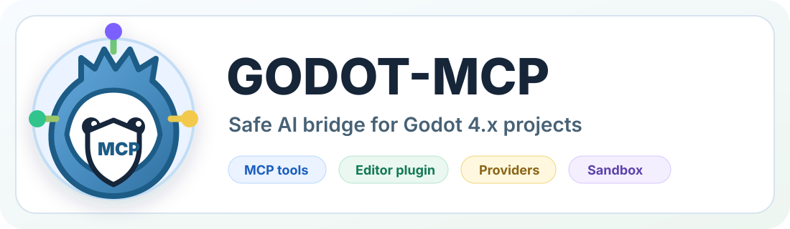
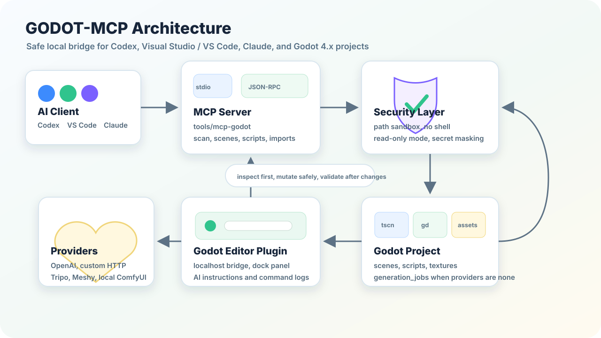

# GODOT-MCP

<p align="center">
  
</p>

Godot MCP AI Bridge for safe AI-assisted Godot 4.x development.

Safe local MCP tooling for Godot 4.x projects, designed so Codex or another AI agent can inspect and automate a Godot project without getting direct access to arbitrary shell commands or files outside the project.

This repository contains:

- A dependency-light MCP stdio server for Godot project automation.
- A Godot EditorPlugin bridge for editor-side operations and AI instructions.
- Project-specific agent skills and beginner-oriented docs.
- Safe provider interfaces for image/sprite/texture and 3D model generation.
- A conservative security layer for paths, secrets, and command execution.

## Why This Exists

AI agents are useful in Godot only when they can see the project, understand scenes and scripts, run checks, and make small safe changes. This project gives the agent a structured API instead of asking it to guess Godot file formats or run risky commands.

The goal is not to expose every Godot feature at once. The goal is a stable base:

1. Inspect first.
2. Edit only inside the project.
3. Keep destructive actions out.
4. Queue generation jobs when no real provider is configured.
5. Use Godot's own editor bridge for richer scene operations.

<p align="center">
  
</p>

## Current Capabilities

The local MCP server lives in `tools/mcp-godot/` and exposes these tools:

- `godot_help`
- `godot_bridge_status`
- `godot_project_scan`
- `godot_list_scenes`
- `godot_read_scene`
- `godot_create_scene`
- `godot_add_node`
- `godot_update_node`
- `godot_attach_script`
- `godot_create_script`
- `godot_import_image`
- `godot_generate_sprite`
- `godot_generate_texture`
- `godot_import_3d_model`
- `godot_generate_3d_model`
- `godot_run_project`
- `godot_check_errors`

Text `.tscn` scenes are supported for simple file-based edits. Binary `.scn` scenes are intentionally not edited as text; use the editor bridge for those workflows.

## Project Layout

```text
addons/
  ai_mcp_bridge/
  asset_import_helper/
  debug_tools/
  generated_assets_browser/
  scene_builder_tools/
Assets/
  generated/
    sprites/
    textures/
    models/
  models/
  materials/
  textures/
  source/prompts/
docs/
generation_jobs/
scenes/
scripts/
tools/mcp-godot/
```

The original project currently uses `Assets/` with an uppercase `A`. On Windows this works with `assets/...` paths because the filesystem is case-insensitive. The tools do not rename folders automatically.

## Requirements

- Godot 4.x.
- Node.js 18+.
- Optional: Godot CLI on `PATH` for headless checks and project runs.
- Optional: API keys in `.env` for real image/model providers.

No API keys are committed. Use `.env.example` as the template.

## Quick Start

Run the smoke test from the project root:

```powershell
node .\tools\mcp-godot\test\smoke.mjs
```

If you use the Codex bundled Node.js runtime:

```powershell
& 'C:\Users\gdima\.cache\codex-runtimes\codex-primary-runtime\dependencies\node\bin\node.exe' '.\tools\mcp-godot\test\smoke.mjs'
```

Expected output:

```text
mcp-godot smoke test passed
```

## MCP Configuration

Example Codex config:

```toml
[mcp_servers.godotMCP]
command = "C:\\Users\\gdima\\.cache\\codex-runtimes\\codex-primary-runtime\\dependencies\\node\\bin\\node.exe"
args = [ "C:\\path\\to\\project\\tools\\mcp-godot\\src\\server.mjs", "--project-root", "C:\\path\\to\\project" ]
startup_timeout_sec = 20
env = { GODOT_PROJECT_ROOT = "C:\\path\\to\\project" }
```

Context7 can be added separately for documentation lookup:

```powershell
codex mcp add context7 -- npx -y @upstash/context7-mcp
```

Restart the AI client after changing MCP config.

## Editor Plugin Bridge

Enable `AI MCP Bridge` in Godot:

```text
Project > Project Settings > Plugins > AI MCP Bridge > Enable
```

The dock can start a localhost TCP bridge at:

```text
127.0.0.1:8765
```

The MCP tool `godot_bridge_status` checks whether the bridge is reachable.

The dock also includes an AI instruction panel. You can write the task inside Godot, choose the target client, and save ready-to-use notes:

- `docs/AI_AGENT_INSTRUCTIONS.md`
- `docs/AI_CLIENT_SETUP.md`

Supported client presets:

- Codex
- Visual Studio / VS Code
- Claude

## Providers

Supported image provider names:

- `none`
- `openai`
- `polza_ai`
- `local_comfyui`
- `custom_http`

Supported 3D provider names:

- `none`
- `tripo`
- `meshy`
- `custom_http`

When provider is `none`, no real asset generation happens. The request is saved as a JSON job under `generation_jobs/`.

Real keys must come from `.env` or environment variables, never source files.

## Security Model

- All paths are resolved inside the Godot project root.
- Absolute destination paths are rejected.
- Existing files are not overwritten unless the tool explicitly supports and receives `overwrite: true`.
- Arbitrary shell commands are not exposed.
- Godot CLI execution uses a whitelist of known command shapes.
- `.env` is ignored by Git.
- Logs are sanitized for common secret/key/token patterns.
- `GODOT_MCP_READ_ONLY=true` blocks write/run/generation tools.

## Documentation

- `docs/MCP_GODOT_SETUP.md`
- `docs/GODOT_MCP_RESEARCH.md`
- `.agents/skills/*/SKILL.md`
- `.codex/skills/*/SKILL.md`

## Validation

Run:

```powershell
node --check .\tools\mcp-godot\src\server.mjs
node --check .\tools\mcp-godot\src\providers.mjs
node .\tools\mcp-godot\test\smoke.mjs
```

If Godot CLI is not available, `godot_check_errors` still runs static validation and reports that headless validation was skipped.

## Roadmap

- WebSocket bridge with heartbeat/reconnect.
- UndoRedo-backed editor mutations.
- Runtime autoload bridge for screenshots, input simulation, and runtime tree inspection.
- Optional LSP/DAP/ClassDB integrations.
- More provider adapters behind the existing safe interface.
- Tool profiles for compact/full client modes if the tool surface grows.
- Deeper editor-side workflows started directly from the AI instruction panel.

## License

MIT. Use it freely, including in personal, educational, and commercial projects.
